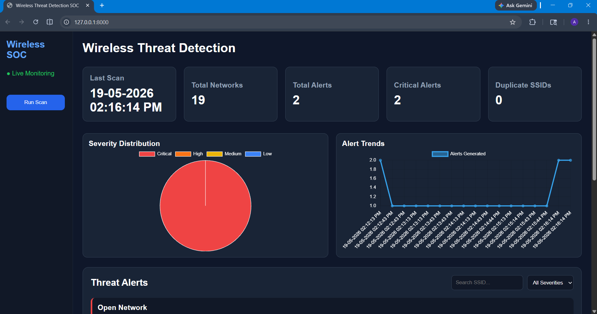
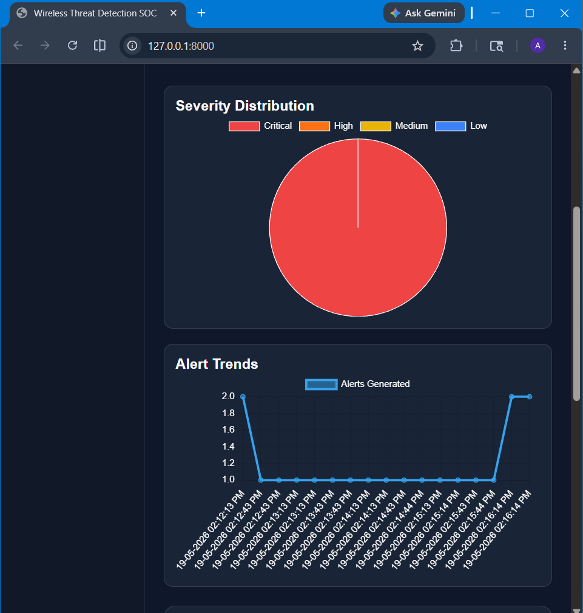
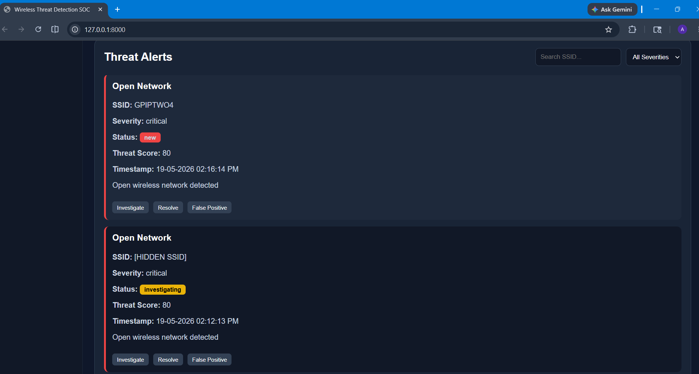
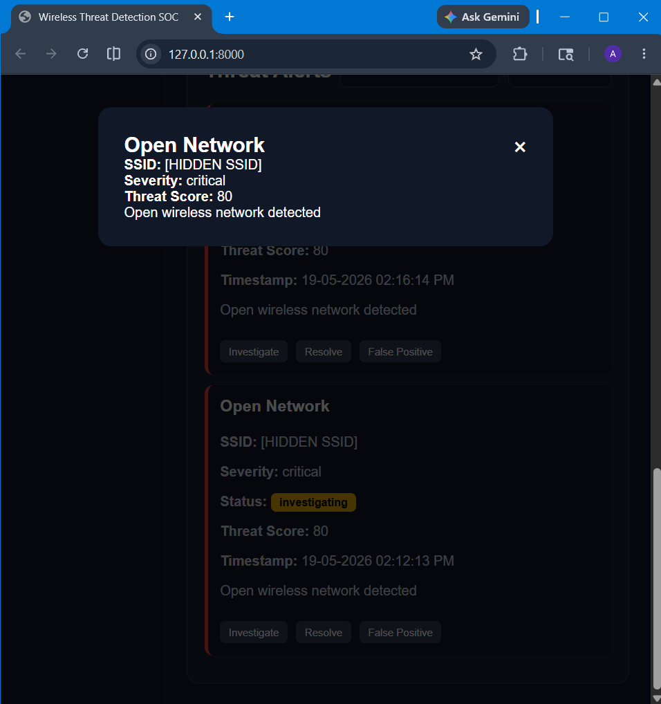
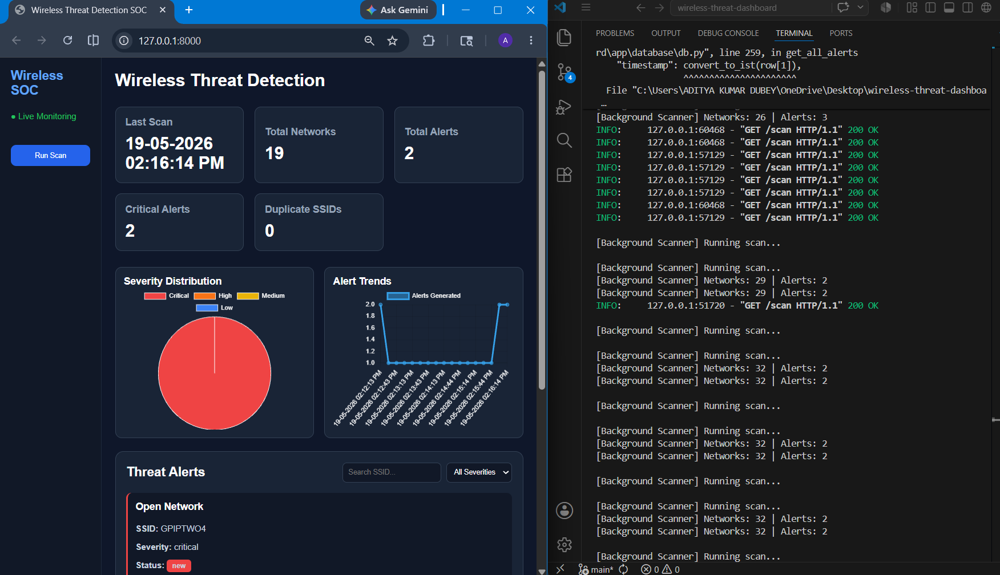

# Wireless Threat Detection SOC Dashboard

A real-time wireless threat monitoring and analytics platform built using Python, FastAPI, SQLite, WebSockets, and Chart.js.

## Features

- Real-time Wi-Fi telemetry collection
- Continuous background scanning
- Wireless threat detection engine
- Threat scoring system
- SQLite alert persistence
- FastAPI backend APIs
- Real-time WebSocket dashboard updates
- SOC analytics dashboard
- Severity visualization charts
- Alert investigation workflows
- Alert lifecycle management
- Search and filtering

## Architecture

Wi-Fi Scanner
    ↓
Telemetry Parser
    ↓
Detection Engine
    ↓
Threat Scoring
    ↓
SQLite Database
    ↓
FastAPI Backend
    ↓
WebSocket Streaming
    ↓
SOC Dashboard

## Tech Stack

- Python
- FastAPI
- SQLite
- HTML/CSS/JavaScript
- Chart.js
- WebSockets

## Installation

```bash
git clone <repo-url>

cd wireless-threat-dashboard

python -m venv venv 

venv\Scripts\activate

pip install -r requirements.txt

uvicorn app.main:app --reload
```

# Screenshots Section

## Dashboard Screenshots




